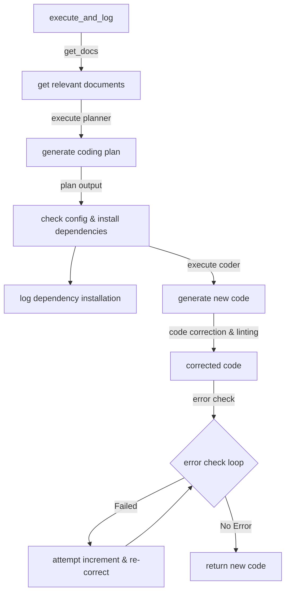
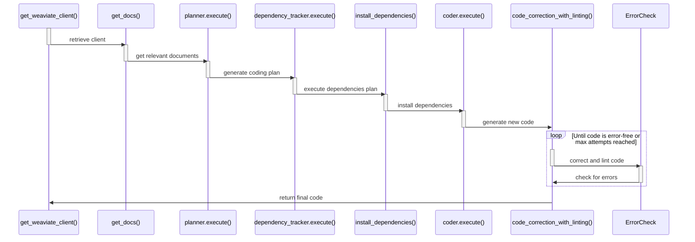
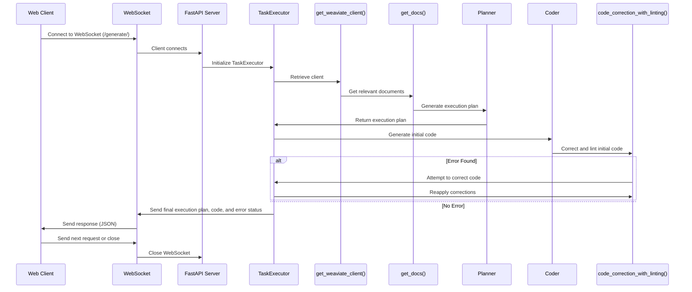

# Diagram tools

## pyreverse

you can use `pyreverse` to automatically generate UML diagrams for your code. it is included in the package `pylint`. To use:

```bash
pyreverse code_dir
```

this is going to generate a file called called `classes.dot` which contains the UML diagram, and a file called `packages.dot`, which contains the dependency graph of your project. In order to convert this file to an image, you can use `dot`.
For this you need to locally install `graphviz` so that you can access the command `dot`. After installing `graphviz`, use the command:

```bash
dot -Tpng classes.dot > class_diagram.png
```

### Task execution Interaction Graph




### Task execution Sequence Diagram




### App Sequence Diagram


